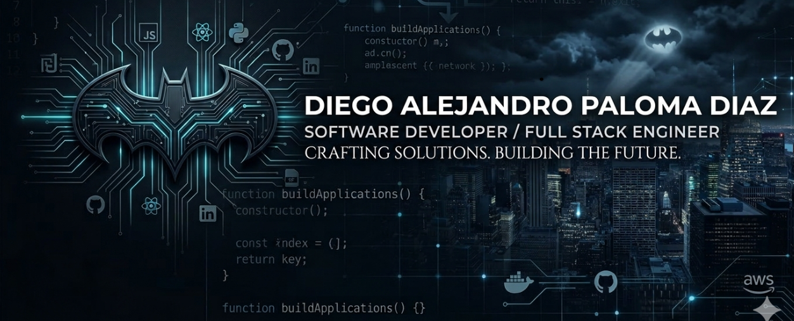

<h1 align="center">Hola, soy Diego Alejandro Paloma Díaz 👋</h1>

  

  Técnico en Programación de Software | Proximo tecnólogo en analsis y desarrollo de software  
  Apasionado por el desarrollo web, diseño de interfaces y resolución de retos técnicos.  

# 🔎 Sobre mí

🎓 Soy Técnico en Programación de Software y proximo Tecnólogo en Análisis y Desarrollo de Software en el SENA. También cuento con múltiples certificaciones en el uso de nuevas tecnologías e inglés.  
💡 Estoy en proceso de formación para convertirme en Ingeniero de Software, con un enfoque fuerte en desarrollo web, lógica y arquitectura de aplicaciones modernas.   

Me apasiona crear soluciones digitales modernas, accesibles y de alto rendimiento utilizando HTML, CSS, JavaScript y otras tecnologías emergentes.  
Trabajo constantemente en fortalecer mis fundamentos y habilidades para enfrentar desafíos reales en el mundo profesional del desarrollo de software.

## 🛠️ Tecnologías

### Lenguajes, frameworks y herramientas que manejo o estoy aprendiendo:

## 📁 Proyectos destacados

- 🧠 [Gestión de medallería Olimpiadas (Laravel + React)](https://github.com/Diegoalejandro17/Gestion-de-medallas-y-pasies-)
- 🎖️ [Prueba Regional Worldskills 2025 (Laravel + React )](https://github.com/Diegoalejandro17/worldskills-pruebaregional-2025)
- 📱 [Sistema de autenticación móvil con React Native](https://github.com/Diegoalejandro17/Sistema-de-autenticacion-movil-con-React-Native)
- 🎯 [WorldSkills Módulo A - Speed Test](https://github.com/Diegoalejandro17/entrenamiento-worldskills)

  ---

## 📊 Mis Estadísticas

  
  

  

  

---

### 💬 ¿Tienes un proyecto en mente? ¡Hablemos!

 

## 📜 Licencia

Este perfil y sus contenidos están desarrollados con fines educativos y de autoaprendizaje en el mundo real del desarrollo de software.
